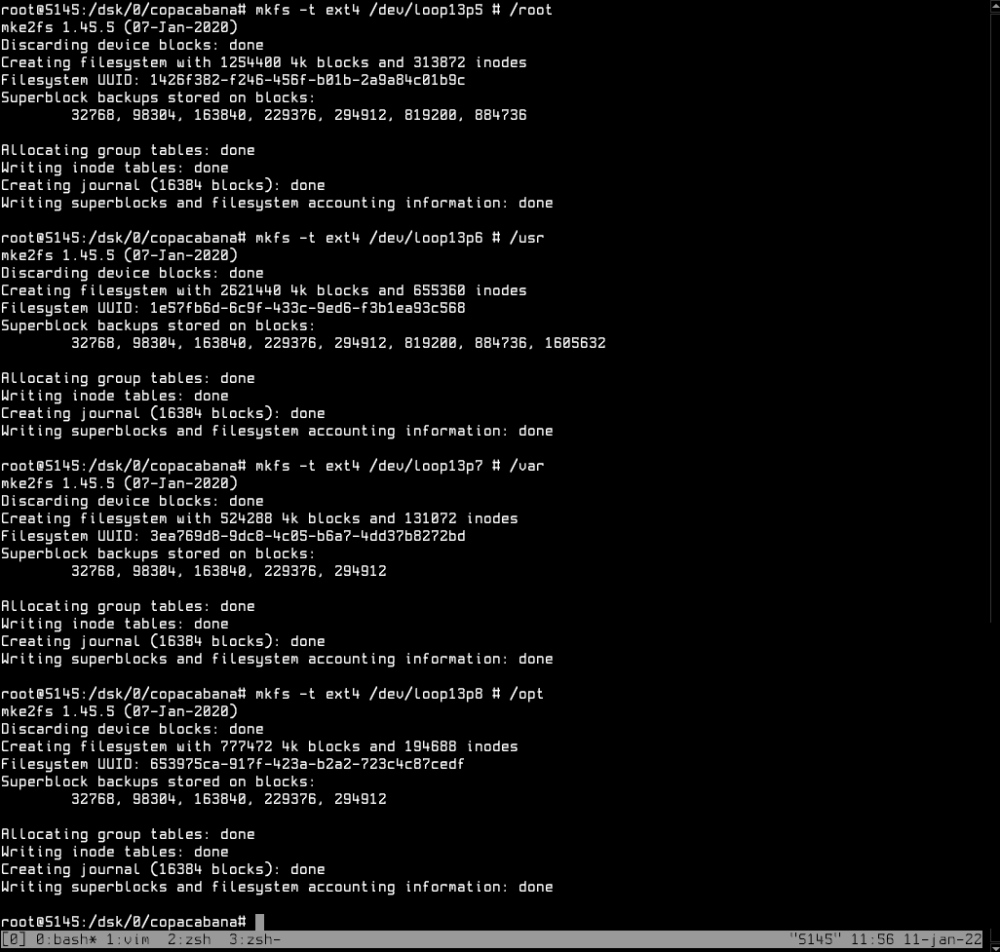

# Laying the groundwork

In this section, we're going to lay the groundwork to start compiling Copacabana
Linux. Its procedures are similar to how Linux from Scratch is built, but with
remarkable differences (and errors) between them.  
To be honest, trying to compile it is a pretty infuriating experience ---
principally if you have a slow machine.  

This is the process for building Copacabana 1.0, but it probably won't change a
lot in future releases.

## Preparing the host system

### Installing needed packages

In case of Arch Linux, the most part of the packages are already installed, but
we will update them. About the kernel: if you have `linux-lts`, update it; if
not, update your kernel variant.    
Copacabana, in other hand, has all these packages or installed into the base
system (such as star or ksh93) or in separated stages, as said before.  

=== "Arch Linux"

    ```console
    fulano@arch-workstation:~$ doas pacman -Syuv linux-lts base-devel util-linux \
				gcc coreutils diffutils findutils patch gawk grep \
				glibc bash ksh python m4 bzip2 pigz xz curl 
    ```
=== "Ubuntu"

    ```console
    fulano@ubuntu-workstation:~$ doas apt-get install -vy build-essential bison \
				gawk grep m4 makeinfo make bash ksh python m4 bzip2 \
				pigz xz curl 
    ```
=== "Copacabana"

    ```console
    workstation%; whoami
    fulano 
    workstation%; # TODO: download/get the development stages from somewhere etc 
    ```

#### Installing Pindorama packages 

In case of the two Pindorama packages --- Mitzune and L.E.`mount` --- installing them is
pretty straightfoward, since they're just tarball containing files to be placed
exacty in your \*NIX file system layout.  
**Note**: It's not availiable as formal packages for any Linux distributions nor
as recipes (eg.: AUR) mostly because --- except in case of Mitzune, which uses an
odd packaging format, installing in the `~` and not in the root --- I don't have
patience for it.  

As said in Mitzune's documentation, it needs to be installed in the `~`
directory, since it's designed to be installed as an user-local script.  
This command line below will download it and unpackage it directly to your `~`
directory.  
If `$HOME/.local/bin` isn't on your `$PATH`, remember to set it up.  
**Note**: ==do this using your own user==, not `root` nor `baggio` (we will
talk about him later on). In these examples, the user is called `fulano` ---
which is, for the sake of curiosity, an equivalent in Portuguese for "John Doe".  

```console
workstation%; curl https://get.pindorama.dob.jp/mitzune/releases/mitzune.0.2-a.NOARCH.Linux.tar.xz -L --output - | xz -cd - | tar -xvf - -C ~/
```

In other hand, L.E.mount needs to be installed in the root file system.  
For installing it, we will use this command line below, that does the same 
thing that the command line above, with the exception of making use of `doas`
and unpackaging into the root file system. You also could run it directly as
`root` (a.k.a `su -c`), but it isn't the safest thing in the world.   

```console
workstation%; curl https://get.pindorama.dob.jp/lemount/releases/lemount-0.1.NOARCH.Copacabana.tar.xz -L --output - | xz -cd - | doas tar -xvf - -C /
```

After installing everything, exit your Shell and fire it up again, so the
`$PATH` will be re-cached and the new binaries indexed.   

### Optional: mounting an external disk
Before creating the virtual disk image, you may want to save it in an external
device instead of saving it directly on your host directory --- even because
filling your `~` directory with a 20GB< file isn't the best thing to do. 

For this, we'll be using L.E.`mount`, since you'll have to be used to it anyway.  
Don't worry, it's pretty easy. In this example, I used command-line switches
instead of the interactive menu since it saves time.  

```console hl_lines="2 22"
└─sdc1   8:33   0 298,1G  0 part                                                
S145%; doas lemount -D /dev/sdc1 -t dsk                                         
doas (luiz@S145) password:                                                      
Creating mount points...                                                        
done.                                                                           
                                                                                
Disk /dev/sdc1 is dsk                                                           
count_lemounted_disks() debugging:                                              
root=/                                                                          
type=dsk                                                                        
base_number=0                                                                   
disk_postfix=""                                                                 
mount_block() debugging:                                                        
disk=/dev/sdc1                                                                  
target=/dsk/0                                                                   
link_from_type2mnt() debugging:                                                 
root=/                                                                          
type=dsk                                                                        
base_number=0                                                                   
disk_postfix=""                                                                 
/dev/sdc1 was mounted succesfully at /dsk/0.                                    
ledisk=/dsk/0                                                                   
S145%;                                                                          
```

L.E.`mount` will return an environment variable definition to the standard
output, it's not strictly necessary to put this variable in your
`~/.profile` (since when we'll be mounting another disk, it will create
another variable with the same identifier, but containing another value),
but you can do this:
```console
workstation%; eval `doas lemount -D /dev/sdXY -t dsk` && cd $ledisk; pwd
```
This will evaluate the variable definition returned by L.E.`mount` and then
change the directory to it automatically.  

### Creating and mounting the virtual disk image

For working in Copacabana, we can create a virtual disk image or use another
physical disk; the only difference between these processes is, in fact, creating
the virtual disk and mounting with L.E.`mount`.  

For creating the virtual disk, we will be using `dd`(1).  
"`20`" will be our value in gigabytes, it's enough to handle the sources and, of
course, the final system. You may want to use less or even more space, that's up to you.  

```console
workstation%; dd if=/dev/zero of=BASE.img bs=512k count="`echo '(20 * 1024 ^ 2)/ 512' | bc`"
```  

After that, we must initialize this image with a filesystem. For this, we'll be using
`cfdisk`(8) and `mkfs.*`.

#### And yet here we are: partitioning the disk image

Now, after creating the disk image, we will partition it and then expose to the
system using `losetup`(8).  
Since our virtual disk will reflect the final instalation, we will be creating
four partitions besides `/`.  

| Mounting point | Fixed size (MB) | Generic size (%) |
|----------------|-----------------|------------------|
| /              | 4,750 MB        | 23.750 %         |
| /boot          | 250 MB          | 1.25 %           |
| /var           | 2,000 MB        | 10 %             |
| /opt           | 3,000 MB        | 15 %             |
| /usr           | 10,000 MB       | 50 %             |  

**Note**: May you'll keep `/boot` as 250 MB in your final installation, mostly
because you won't be needing more than this for it, since it just storages the
Linux kernel and some bootloader files.  

Your final partition scheme shall look like this:  
  
The root partition is actually part of a logical partition, along with `/var`,
`/opt` and `/usr`.  

#### Exposing the disk to the system

For this, as I said in the last session, we will be using `losetup`(8), it comes
along with util-linux.  
Just type the following:  
```console
workstation%; doas losetup -Pf BASE.img
```  
`-P` will tell Linux to scan the partition table and `-f` will show us what is
the identifier (call it "name" for short) of the loop device is --- what isn't
exactly essential considering that we will need to use `fdisk -l` to list the
partitions later anyway.  

#### Initializing a Linux file system on the disk

After exposing to the system, we must initialize a file system on the
partitions.  
For the `/boot` partition, we're going to use ext2, and for the rest, ext4.  
Run `fdisk -l` to list the partitions, then just format them with `mkfs`.  



### Entering `root`

In this section, we'll be entering `root` and setting up another user for
cross-compiling the system.  

```console
workstation%; doas su
doas (fulano@workstation) password:
workstation#; whoami
root
workstation#;
```

#### Creating the `baggio` user 

It is recommended to create an unprivileged user for cross-compiling the
system, both because the fact that one single mistake can trash your host
system --- I remember crashing my Arch installation two years ago after
trying to cross-compile a vanilla LFS system --- and because getting
packages over the Web and compiling them as `root` isn't really safe.  

Our new user (and also group) will be called `baggio`, to keep things
simpler --- you can also create them with other name, still.  

```console
workstation#; useradd baggio -k /dev/null -m
```
`-k /dev/null` will use `/dev/null` as the `skel` directory, in other words, this
prevents `/{etc,usr}/skel` to be copied into his `~` directory.  
`-m` just creates the `~` directory.  

We may also give him a password, for this, use `passwd`(1).  
```console
workstation#; passwd baggio
```
The password used for `baggio` is "`caffe`" ("coffee" in italian), but you may
use other password if you want.  

After creating the user, create a group with the same name and then add the user
to it.  
```console
workstation#; groupadd baggio
workstation#; usermod -aG baggio baggio
```

#### Setting up the cross-compiling environment  

 
